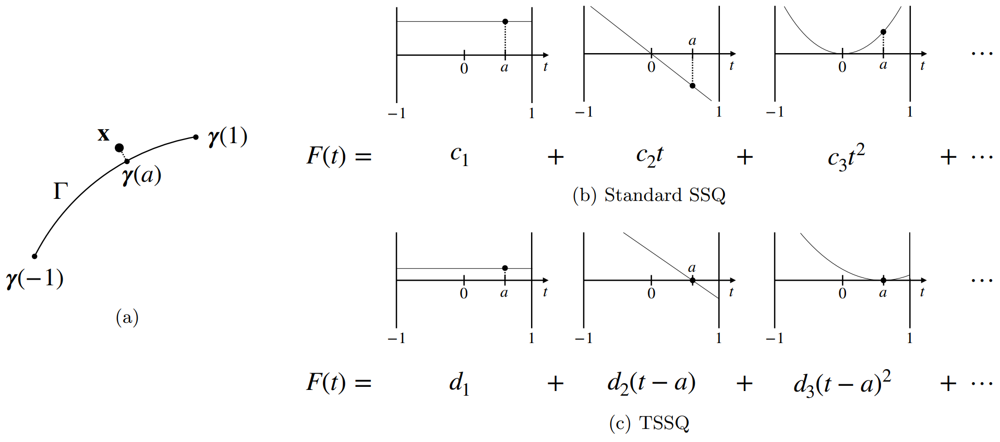
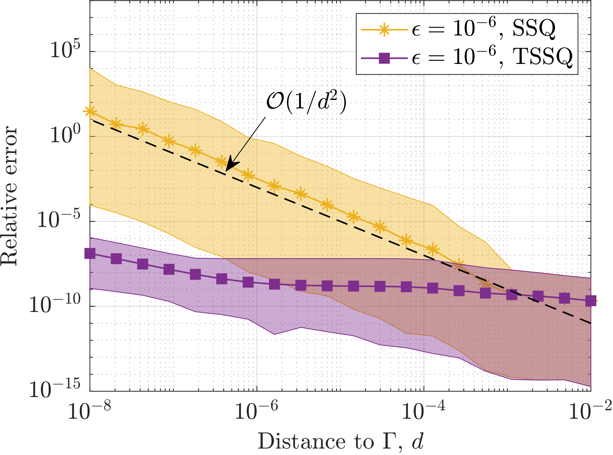

# TSSQ: Translated Singularity Swap Quadrature

[](https://doi.org/10.5281/zenodo.17962660)

 **tssq-matlab** provides a MATLAB implementation of the quadrature proposed in the preprint [Stabilizing the singularity swap quadrature for near-singular line integrals](https://arxiv.org/abs/2509.23881) by D. Krantz, A. H. Barnett and A.-K. Tornberg.

 Translated singularity swap quadrature (TSSQ) extends the standard SSQ method with translated bases that avoid catastrophic cancellation and achieve high accuracy for very close evaluation.



 ## Dependencies

 This repository builds on two external packages:

 - **[ludvigak/linequad](https://github.com/ludvigak/linequad)**  
  Original SSQ code containing core quadrature routines.
 - **[taiya/kdtree](https://github.com/taiya/kdtree)**  
  Minimalist kd-tree implementation for neighbor searches.

> Optional: **[chebfun](https://github.com/chebfun/chebfun)** (only used in some test scripts)

## Setup

After cloning, `cd` to the root of this repo and initialize the submodules by running
```
git submodule update --init --recursive
```

### Compilation

#### *linequad*
From the root of this repo within MATLAB:
```
cd external/linequad/matlab
make
```

#### *kdtree*
From the root of this repo within MATLAB:
```
cd external/kdtree/toolbox
kdtree_compile
```
**NOTE**: To compile *kdtree* on macOS, replace line 154 in `external/kdtree/toolbox/MyHeaps.h`
```
return std::__is_heap(heap.begin(), heap.end() );
```
with
```
return std::is_heap(heap.begin(), heap.end());
```

## Usage

1. Start MATLAB in the root of this repo.
2. Run `init` to add paths.
3. Try the examples:
    - **Basic examples**:
        - `matlab/examples/example_open_curve_monomial.m`
        - `matlab/examples/example_closed_curve_fourier.m`
    - **Paper examples**:
        - `matlab/examples-paper/long_filament.m`
        - `matlab/examples-paper/deformed_starfish.m`
        - `matlab/examples-paper/bases_comp_flat_panel.m`

- Comparison of SSQ and TSSQ for close evaluation of the slender-body kernel with error tolerance $`10^{-6}`$.



## Main functions

Core entry points for users are:

- **`ssq_sbt(curve,density,targets,opts)`**  
  Standard SSQ for the slender-body kernel.

- **`tssq_sbt(curve,density,targets,opts)`**  
  Translated SSQ (TSSQ) for the slender-body kernel. Automatically switches between standard and modified bases.


## Supporting routines

These are lower-level routines used internally by SSQ/TSSQ, but may be useful for advanced users.

### Monomial (open curves)

- **Standard basis integrals**:  
  `external/linequad/matlab/src/recursions/rsqrt_pow_integrals.m`

- **Translated basis integrals**:  
  `matlab/src/recursions/rsqrt_pow_integrals_shift.m`

- **SSQ weights**:  
  `external/linequad/matlab/src/line3_near_weights.m`

- **TSSQ weights**:  
  `matlab/src/near_weights_monomial.m`

- **Quadrature driver**:  
  `matlab/src/interpolatory_quadrature_monomial.m`

### Fourier (closed curves)

- **Standard basis integrals**:  
  `matlab/src/recursions/rsqrt_pow_integrals_fourier.m`

- **TSSQ weights**:  
  `matlab/src/near_weights_fourier.m`

- **Adjoint helper for modified Fourier basis**:  
  `matlab/src/adjoint_modified_fourier.m`

- **Modified Fourier coefficients**:  
  `matlab/src/fourier2modcoeffs.m`

- **Quadrature driver**:  
  `matlab/src/interpolatory_quadrature_fourier.m`

## Code structure

```
matlab/
├── examples/        % simpler demos
├── examples-paper/  % scripts for figures in the paper
├── src/             % main TSSQ and SSQ routines
├── test/            % tests and exploratory scripts
├── utils/           % helper routines (interpolation, Vandermonde, etc.)
```
External dependencies are in `external/`.
